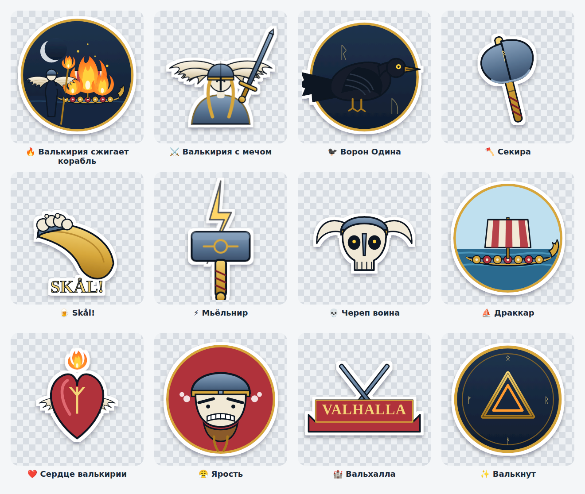

# 🔥 Valkyrie & Vikings — Telegram-стикерпак

Уникальный набор из **12 стикеров** в едином стиле «saga emblem» (жирные плоские формы,
тёмный контур, золото + угли). Центральный стикер — **Валькирия сжигает драккар** 🔥.
Вся графика нарисована с нуля в векторе и отрендерена в PNG под требования Telegram —
это не собранные из интернета картинки, пак оригинальный.



## Что внутри

| Emoji | Стикер | Файл |
|------|--------|------|
| 🔥 | Валькирия сжигает корабль | `stickers/01_burning_ship.png` |
| ⚔️ | Валькирия с мечом | `stickers/02_valkyrie_sword.png` |
| 🐦‍⬛ | Ворон Одина | `stickers/03_raven.png` |
| 🪓 | Секира | `stickers/04_axe.png` |
| 🍺 | Skål! | `stickers/05_horn.png` |
| ⚡ | Мьёльнир | `stickers/06_mjolnir.png` |
| 💀 | Череп воина | `stickers/07_skull.png` |
| ⛵ | Драккар | `stickers/08_longship.png` |
| ❤️ | Сердце валькирии | `stickers/09_heart.png` |
| 😤 | Ярость | `stickers/10_rage.png` |
| 🏰 | Вальхалла | `stickers/11_valhalla.png` |
| ✨ | Валькнут | `stickers/12_valknut.png` |

Все файлы: **512×512 PNG**, прозрачный фон, белая обводка-контур, каждый < 512 КБ —
ровно как требует Telegram для статичных стикеров.

## Как загрузить пак в Telegram (2 минуты)

Стикерпаки создаются только через официального бота — сделать это за тебя из этой
среды нельзя, но всё готово к заливке:

1. Открой в Telegram чат с **[@Stickers](https://t.me/Stickers)**.
2. Отправь команду **`/newpack`**.
3. Введи название пака, например **`Valkyrie & Vikings`**.
4. Дальше бот просит по одному: **перетащи PNG-файл** (не «фото», а именно файл!) →
   пришли **эмодзи** для него из таблицы выше. Повтори для всех 12 в порядке 01…12.
   > На телефоне: «Скрепка → Файл». На десктопе просто перетащи PNG в окно.
5. Когда все добавлены — отправь **`/publish`**.
6. Задай **короткое имя** пака (латиницей), например `valkyrie_saga` — из него
   получится ссылка `t.me/addstickers/valkyrie_saga`.

Готово — пак твой и делится по ссылке.

## Пересобрать графику

```bash
cd valkyrie-stickers
npm install playwright-core          # рендер через headless Chromium
node render.mjs ./stickers           # перерисует все PNG + preview
```
Вся отрисовка — в `stickers.mjs` (палитра, формы, отдельные стикеры). Меняй цвета/формы
и запускай `render.mjs` — получишь обновлённый пак.

## Хочешь фотореалистичные версии через Flux

Внутри этой среды доступ к Flux/Pollinations заблокирован сетевой политикой, поэтому
пак сделан в векторе. Но рядом лежит **`generate_flux.sh`** с подобранными промптами
на каждый стикер — запусти его на своей машине (где Flux открыт), и получишь
фотореалистичные картинки теми же сюжетами. См. комментарии в скрипте.
